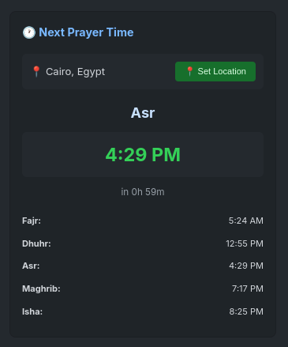
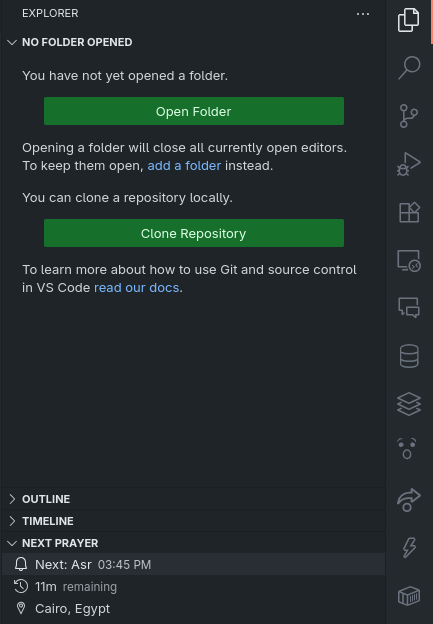
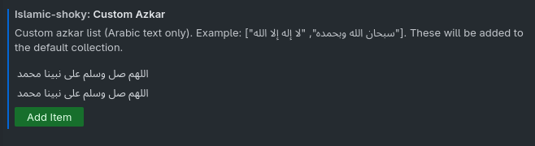
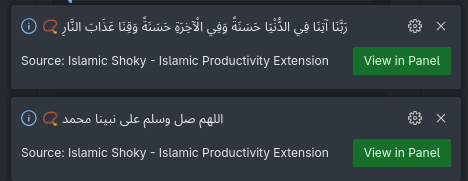
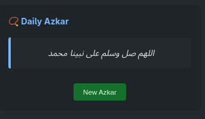
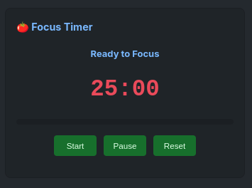
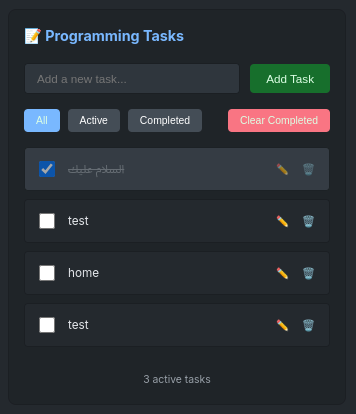

# Islamic Shoky - Islamic Productivity Extension

A comprehensive Islamic productivity extension for Visual Studio Code that helps Muslim developers maintain their faith while coding. Islamic Shoky combines spiritual features with productivity tools to create a balanced development environment.

## 🌟 Features

### 🕌 Prayer Times

- **Accurate Prayer Times**: Get precise prayer times based on your location using multiple calculation methods
- **Smart Notifications**: Receive notifications at prayer time and Islamic reminders 5 minutes after each prayer
- **Location Detection**: Automatic location detection or manual location setting
- **Multiple Calculation Methods**: Choose from ISNA, Muslim World League, Umm Al-Qura, and more

  

- **also you can find it in Explorer tab**- **also you can find it in Explorer tab**

  

### 📿 Daily Azkar (Islamic Remembrances)

- **Automatic Rotation**: Beautiful Islamic azkar that change automatically every 30 minutes
- **Custom Azkar**: Add your own favorite azkar to the collection

  

- **Sound Notifications**: Special audio notifications for Prophet Muhammad's azkar (ﷺ)
  
- **Arabic Text**: Authentic Arabic text with proper Islamic calligraphy

  

### ⏱️ Pomodoro Timer

- **Focus Sessions**: 25-minute focused work sessions with customizable duration
- **Break Reminders**: 5-minute breaks to maintain productivity
- **Notifications**: Audio and visual notifications for session completion

  

### ✅ Todo List

- **Task Management**: Create, edit, and manage your programming tasks
- **Priority Levels**: Organize tasks by priority
- **Progress Tracking**: Mark tasks as complete and track your progress
- **Local Storage**: Your tasks are saved locally and persist between sessions

  

### 🎨 Beautiful UI

- **Islamic Design**: Clean, modern interface with Islamic aesthetics
- **Dark/Light Theme**: Adapts to your VS Code theme
- **Responsive Layout**: Works perfectly in the sidebar panel
- **Custom Logo**: Personalized branding with your own logo

## 🚀 Installation

1. Open Visual Studio Code
2. Go to Extensions (Ctrl+Shift+X)
3. Search for "Islamic Shoky"
4. Click Install
5. Reload VS Code
6. Find the Islamic Shoky icon in the Activity Bar

## ⚙️ Configuration

Islamic Shoky offers extensive customization options:

### Prayer Times Settings

- `islamic-shoky.enablePrayerTimes`: Enable/disable prayer times display
- `islamic-shoky.prayerCalculationMethod`: Choose calculation method (ISNA, MWL, etc.)
- `islamic-shoky.enablePrayerNotifications`: Enable prayer time notifications
- `islamic-shoky.prayerReminderDelay`: Minutes after prayer for Islamic reminders

### Azkar Settings

- `islamic-shoky.enableAzkar`: Enable/disable azkar display
- `islamic-shoky.azkarChangeDelay`: Minutes between azkar changes
- `islamic-shoky.enableAzkarNotifications`: Show azkar change notifications
- `islamic-shoky.enableAzkarSound`: Play sound for special azkar
- `islamic-shoky.customAzkar`: Add your own azkar

### Productivity Settings

- `islamic-shoky.enablePomodoro`: Enable/disable Pomodoro timer
- `islamic-shoky.focusDuration`: Focus session duration (minutes)
- `islamic-shoky.breakDuration`: Break duration (minutes)
- `islamic-shoky.enableTodoList`: Enable/disable todo list

## 📖 Usage

### Getting Started

1. **Open Islamic Shoky**: Click the book icon in the Activity Bar
2. **Set Location**: Allow location access or set your location manually
3. **Configure Settings**: Customize features in VS Code Settings (Ctrl+,)

### Prayer Times

- View today's prayer times in your local timezone
- Receive notifications at prayer time
- Get Islamic reminders 5 minutes after each prayer
- Choose from multiple calculation methods

### Daily Azkar

- Read beautiful Islamic azkar that rotate automatically
- Add your own favorite azkar to the collection
- Enjoy special audio notifications for Prophet Muhammad's azkar

### Pomodoro Timer

- Start focus sessions with one click
- Take scheduled breaks to maintain productivity
- Get notified when sessions complete

### Todo List

- Add new tasks with descriptions
- Mark tasks as complete
- Edit or delete tasks as needed
- Track your programming progress

## 🕌 Islamic Features

Islamic Shoky includes authentic Islamic content:

- **Prayer Times**: Calculated using Aladhan API with multiple methods
- **Azkar**: Authentic Islamic remembrances in Arabic
- **Islamic Reminders**: Motivational messages in Arabic
- **Sound Notifications**: Islamic audio for special azkar
- **Cultural Sensitivity**: Respectful Islamic design and content

## 🔧 Requirements

- Internet connection for prayer times (optional, can work offline)
- Audio support for sound notifications

## 🤝 Contributing

We welcome contributions! Please see our [Contributing Guide](CONTRIBUTING.md) for details.

1. Fork the repository
2. Create a feature branch
3. Make your changes
4. Add tests if applicable
5. Submit a pull request

## 📝 License

This project is licensed under the MIT License - see the [LICENSE](LICENSE) file for details.

## 🙏 Acknowledgments

- **Aladhan API**: For accurate prayer time calculations
- **Islamic Scholars**: For authentic azkar and Islamic content
- **VS Code Community**: For the amazing extension platform

## 📞 Support

- **Issues**: [GitHub Issues](https://github.com/jooexploit/islamic-shoky-extension/issues)
- **Discussions**: [GitHub Discussions](https://github.com/jooexploit/islamic-shoky-extension/discussions)
- **Email**: youseftamereg@gmail.com

## 🔄 Release Notes

### 1.2.0

- **🎵 Quran Audio Player**: Added comprehensive Quran audio player with support for various renowned reciters
- **📖 Chapter Navigation**: Easy navigation through Quran chapters (Surahs) with play, pause, stop, and skip controls
- **🎨 UI Enhancements**: Completely redesigned user interface with modern design and better user experience
- **🖥️ Improved Navigation**: Enhanced sidebar navigation and panel organization for better workflow
- **📿 Extended Azkar Collection**: Added extensive collection of authentic Islamic azkar and daily duaa (supplications)
- **🌅 Morning/Evening Azkar**: Dedicated morning and evening remembrances with audio pronunciation guidance
- **🔧 Bug Fixes**: Fixed notification timing, improved API reliability, and enhanced error handling
- **⚡ Performance**: Optimized extension loading times and improved memory management
- **🌍 Cross-platform**: Enhanced cross-platform compatibility and better VS Code theme integration
- **🎧 Audio Support**: High-quality audio streaming for Quran and azkar with background playback capability

### 1.0.2

- **Explorer Integration**: Added three new panels in Explorer sidebar (Timer, Next Prayer, Tasks)
- **Pomodoro in Explorer**: Full pomodoro timer functionality directly accessible from Explorer
- **Prayer Times in Explorer**: Next azan time always visible in Explorer panel
- **Simplified Tasks Panel**: Converted Explorer tasks panel to read-only display for better reliability
- **Quick Access Controls**: Timer and prayer location controls available in Explorer
- **Improved Stability**: Fixed task synchronization issues and enhanced error handling
- **Better Visual Feedback**: Enhanced task status indicators and cleaner empty states

### 1.0.0

- Initial release with prayer times, azkar, Pomodoro timer, and todo list
- Location-based prayer time calculations
- Automatic azkar rotation with sound notifications
- Islamic reminder notifications
- Custom azkar support
- Beautiful Islamic UI design

---

**Islamic Shoky** - Bridging faith and productivity in your coding journey. 🕌✨

_Made with ❤️ for the Muslim developer community_

## Working with Markdown

You can author your README using Visual Studio Code. Here are some useful editor keyboard shortcuts:

- Split the editor (`Cmd+\` on macOS or `Ctrl+\` on Windows and Linux)
- Toggle preview (`Shift+Cmd+V` on macOS or `Shift+Ctrl+V` on Windows and Linux)
- Press `Ctrl+Space` (Windows, Linux, macOS) to see a list of Markdown snippets

## For more information

- [Visual Studio Code's Markdown Support](http://code.visualstudio.com/docs/languages/markdown)
- [Markdown Syntax Reference](https://help.github.com/articles/markdown-basics/)

**Enjoy!**
